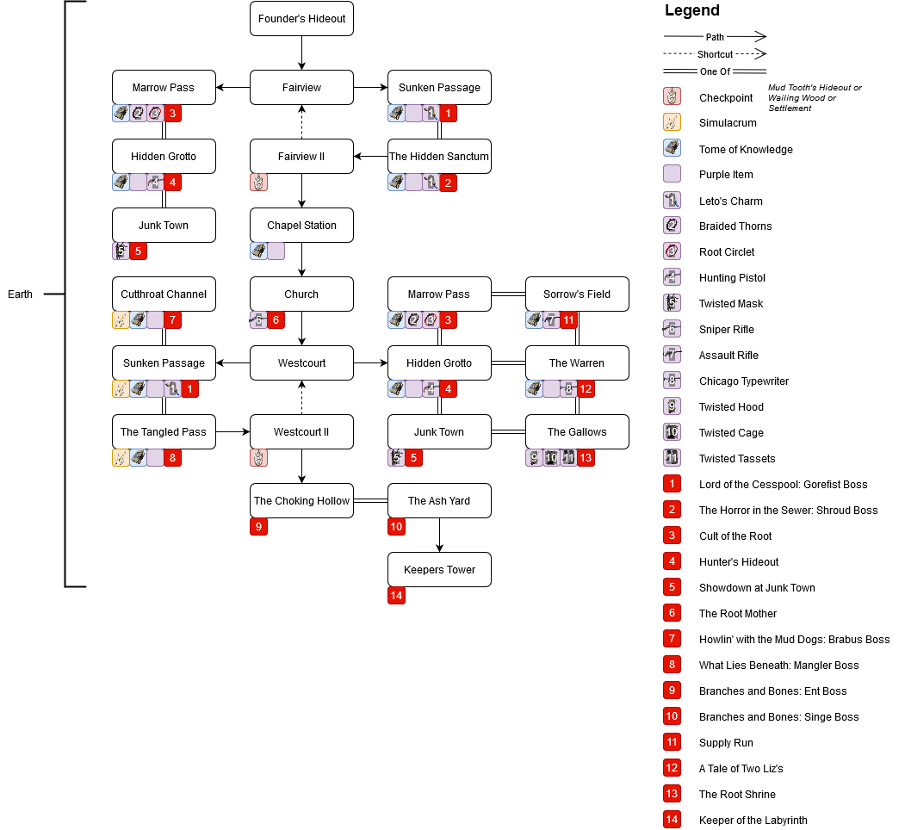
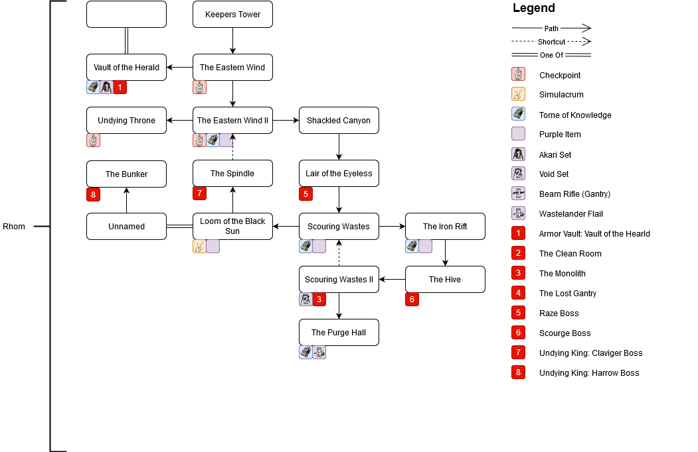
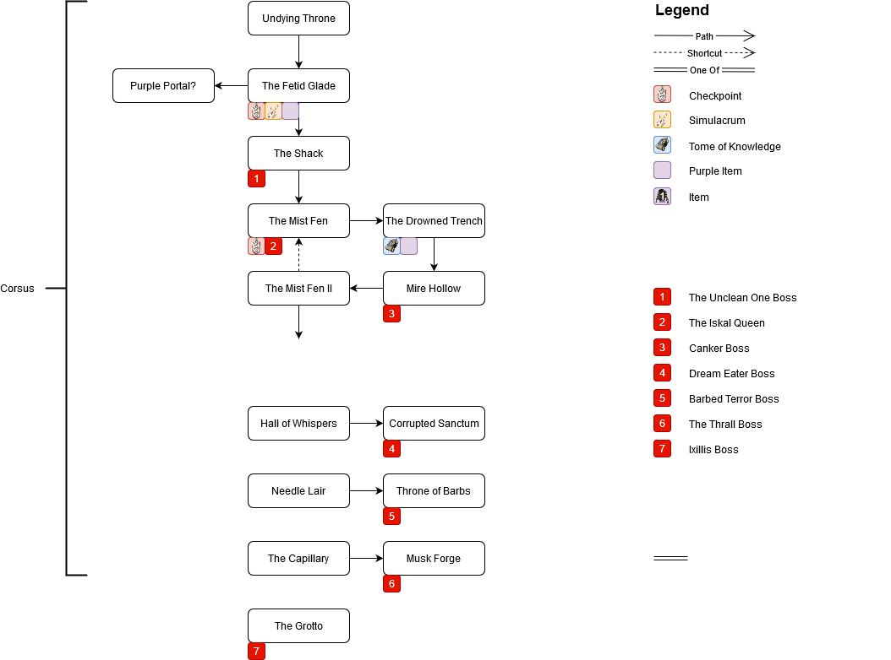

# Remnant-Maps
Making location maps for remnant to be easier to navigate and get collectables.

# Earth

# Rhom

# Corsus

# Contributing
If you found an item/location that doesn't appear on any of the maps, create an issue.

# Credits
Credit to [u/olegbl](https://www.reddit.com/r/remnantgame/comments/cwdzsd/area_map_of_earth/) for making original earth map and [u/Tanugomi](https://www.reddit.com/r/remnantgame/comments/csm1dt/earth_events_and_dungeon_locations/) who gathered a bunch of data u/olegbl used. I have added additional data to the map from my own play-through of the game.
